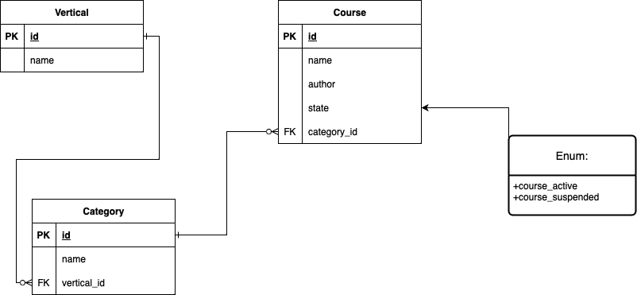

# Ruby on Rails assessment

## 1. Technologies used:

- Docker
- Ruby 3.2.2
- Rails 7.1.1
- PostgreSQL
- ElasticSearch

## 2. Structure

## 3. Tasks

1. [x] Build docker container which includes the above stack
    1. Setup initial ruby image based container
    2. Integrate PostgreSQL
    3. Integrate ElasticSearch

2. [ ] Develop `verticals`
    1. Develop model
    2. Develop controller / API end points
    3. specs

3. [ ] Develop `categories`
    1. Develop model
    2. Develop controller / API end points
    3. specs

4. [ ] Develop `courses`
    1. Develop model
    2. Develop controller / API end points
    3. specs
    4. Integrate ElasticSearch for the `courses#index` 

5. [ ] Update seed

6. [ ] Implement authentication layer

## 4. Answers for future implementations

### How does your solution perform? 
### How does your solution scale?
### What would you improve next?
1. Create an `author` model and move the author out of the `course` model
2. `course` could have multiple `categories`
